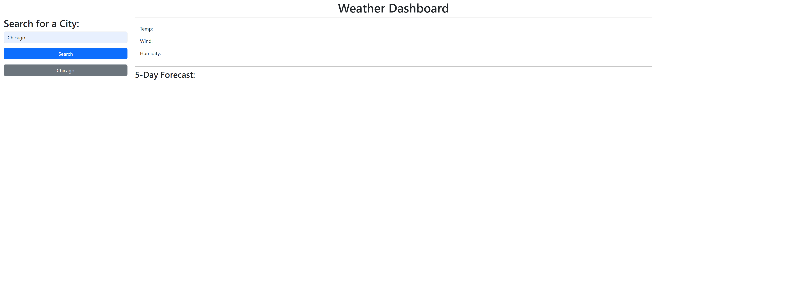

# Weather Application

## Description

This is simple weather forecast application. Users can enter the name of the city in the search bar on the left. They are then presented with the temperature, wind speed, and humidity of the current date and the enxt five days as well.Their searched is also saved ans a clickable button uder the search button so they can just click their previous search again if they need to.

For the Javascript, I put the city the user inputed into  open weather's geocode to get the longitude and latitude of the inputed city. I then used the coodinates i got and put it through open weather's five day forcast API to get the weather for the current date as well as the next five days.

## Link

https://jmcshan1.github.io/Weather-App/
